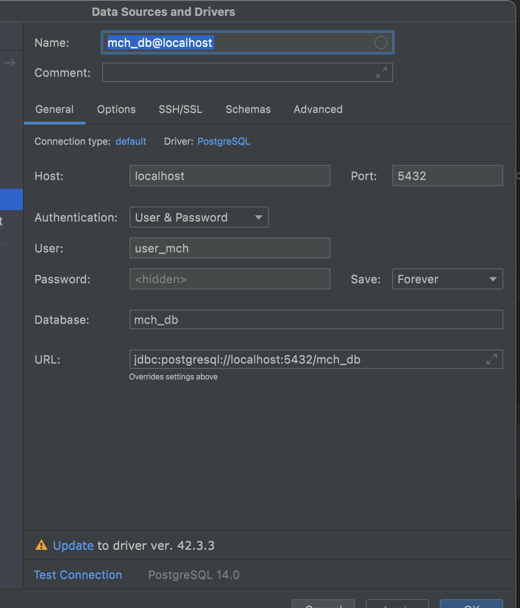

# :heavy_check_mark: [MoscowCityHack2022](https://moscityhack2022.innoagency.ru/#tacks) | Команда LowcatOrNot | Backend :warning:

Backend-часть проекта "Сервис по сбору и анализу информации о продукции производителей Москвы для развития импортозамещения".

Хакатон Moscow City Hack.

:arrow_forward: **[Frontend-репозиторий](https://gitlab.com/Denactive/mch2022-frontend)**

## Задание

Разработайте сервис умного сбора и систематизации информации о выпускаемой продукции компаний-производителей на территории Москвы в единую базу данных с возможностью автоматической кластеризации по видам продукции и гибкой фильтрации для поиска и последующего анализа.

Решение позволит оказать поддержку бизнесу и ускорить процесс импортозамещения, а также своевременно анализировать информацию о продукции, представленной на рынке.

## Команда LowCatOrNot
- [Андрей Кравцов](https://t.me/Kravtandr)  - Backend-разработчик Golang
- [Данила Егоренко](https://t.me/danilaEgorenko) - Frontend-разработчик JS React
- [Денис Кириллов](https://t.me/denactive)  - Fullstack-разработчик JS React / Python

## Презентация :rocket:
- [Подробное описание и мотивация разработки](https://docs.google.com/document/d/1jLJx6QBzKzX5SyYPHv2D7Ulm1HI5HRdRo-Fp4zcTxjY/edit?usp=sharing)
- [Презентация](https://drive.google.com/drive/folders/1J9QcQiZSeBmB7OHF0ut_jUWUZ23YHFSU?usp=sharing)
- [Другие материалы](https://drive.google.com/drive/folders/1gFeC_X9jVWI9ZB3WXPcHytyVjxribGJS?usp=sharing)

## Установка Backend :factory:
  *Требования*
- go 16.7+
- python 3.9+
- Postman 9.19+
- JetBrains DataGrid
- PostgreSQL 14+


    *Инициализация БД*
1. ```psql -U postgres```
2. ```
   CREATE USER user_mch WITH password '123456';
   CREATE DATABASE mch_db OWNER user_mch;
   ```
    *Заполние базы*
3.  Создать пустой проект и подключиться к БД через датагрип

    

4. Выполнить скрипт, скопированный из [mirgate.sql](./mirgate.sql)

    *Запуск сервера*
5. ```go run ./cmd/main.go``` 
6. \* Проверить через Postman: указать в variables title=<любое значение name из таблицы company>

    *Обращение к ML-модели*
7. [описано отдельно тут](./Python/README.md)

## Лицензия
- [GNU GPLv2](./LICENSE)

## Статус проекта
- :wrench: Завершен 9:00 13.06.2022
